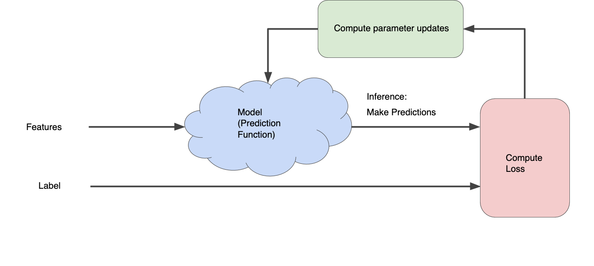

#data #machinelearning
A machine learning algorithm is iterative - it starts with some initial guess an modifies the parameters of the model until the overall loss (function) produces the minimal possible error. This means usually until convergence, i. e. that the error from 1 run to the other changes either very slightly or very slowly.

# Loss
Measures how far the predictions of the model are from the real values (label, target), i. e. how "bad" the model is. To determine this value, a _loss function_ needs to be defined. In case of linear regression, the most common function is _mean squared error_ and in the case of logistic regression it's _log loss_

_squared loss (error)_ ($L_2$ loss)
$$
y...label, \hat{y}...prediction \\
loss_{squared} = (y-\hat{y})^2
$$
* amplifies the influence of outliers because if squaring (unlike $L_1$ loss)

_mean squared error_
$$
MSE = \frac{1}{N} \sum_{i=1...N} loss_{squared_i} \\
N...\text{number of observations}
$$

[@http://zotero.org/users/local/l0LufOnX/items/CNIKLSZG]

