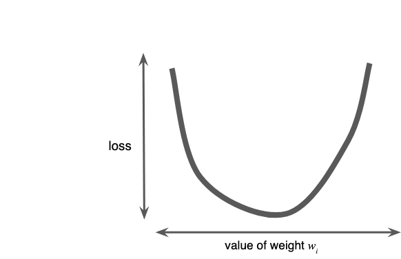
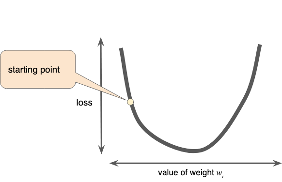
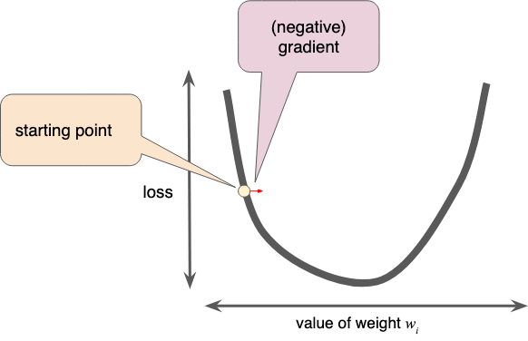
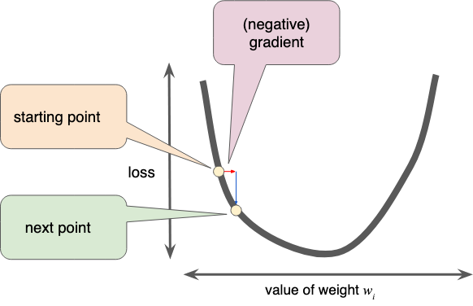

#data #machinelearning #gradient_descent

Regression problems **always yield a convex weight vs. loss plots** (under assumption we calculate loss for all possible weights $w_i$).
	
This kind of function has only 1 minimum (where the slope is 0), which is the place where the loss function converges.

Calculating all possible losses for all weight is inefficient, which is where the technique _gradient descent_ comes into play.

# The Algorithm
Suppose we're working with just 1 weight, $w_i$

1. Pick a starting point for $w_i$ (doesn't matter much which one, e.g. 0 is ok) 

2. Calculate the gradient of the loss function at the starting point. In this example, gradient is the derivative of the function (tells us if we're warmer or colder). In case of multiple weights, the gradient is a vector containing partial derivatives with respect to the weights. To step in the direction of the maximum loss, we need to use _negative gradient_, $-\nabla f$

Keep in mind that since gradient is a vector, it has
* a magnitude
* a direction

3. We move to the next point by adding to the starting point some fraction of the gradients magnitude.

4. Repeat the process until we arrive at the minimum (gradient=0).

Note: In case of multiple parameters, these adjustments are made for all parameters simultaneously.

[@http://zotero.org/users/local/l0LufOnX/items/CNIKLSZG]
