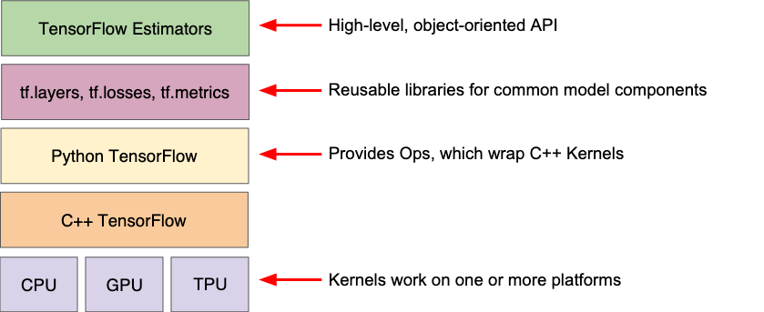

#data



#tensorflow is a framework for building #machinelearning models.

| Toolkit(s)                             | Description                            |  |
|----------------------------------------|----------------------------------------|--|
| -------------------------------------- | -------------------------------------- |  |
| Estimator (tf.estimator)               | High-level, OOP API.                   |  |
| tf.layers/tf.losses/tf.metrics         | Libraries for common model components. |  |
| TensorFlow                             | Lower-level APIs                       |  |

TensorFlow consists of the following two components:

- a graph protocol buffer
- a runtime that executes the (distributed) graph

These two components are analogous to Python code and the Python interpreter. Just as the Python interpreter is implemented on multiple hardware platforms to run Python code, TensorFlow can run the graph on multiple hardware platforms, including CPU, GPU, and TPU.

**tf.estimator API**
tf.estimator is compatible with the scikit-learn API.

```python
import tensorflow as tf

# Set up a linear classifier.
classifier = tf.estimator.LinearClassifier(feature_columns)

# Train the model on some example data.
classifier.train(input_fn=train_input_fn, steps=2000)

# Use it to predict.
predictions = classifier.predict(input_fn=predict_input_fn)
```

# References
1. [Quick Introduction to pandas](<https://colab.research.google.com/notebooks/mlcc/intro_to_pandas.ipynb?utm_source=mlcc&utm_campaign=colab-external&utm_medium=referral&utm_content=pandas-colab&hl=en>): pandas is an important library for data analysis and modeling, and is widely used in TensorFlow coding. This tutorial provides all the pandas information you need for this course. If you already know pandas, you can skip this exercise.
2. [First Steps with TensorFlow](<https://colab.research.google.com/notebooks/mlcc/first_steps_with_tensor_flow.ipynb?utm_source=mlcc&utm_campaign=colab-external&utm_medium=referral&utm_content=firststeps-colab&hl=en>): This exercise explores linear regression.
3. [Synthetic Features and Outliers](<https://colab.research.google.com/notebooks/mlcc/synthetic_features_and_outliers.ipynb?utm_source=mlcc&utm_campaign=colab-external&utm_medium=referral&utm_content=syntheticfeatures-colab&hl=en>): This exercise explores synthetic features and the effect of input outliers.


# Resources
[@http://zotero.org/users/local/l0LufOnX/items/CNIKLSZG]