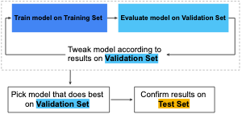

#data 

In #machinelearning, overfitting occurs when the model learn the training data too well, meaning it does not generalize nicely to unseen datan in which case the error on test/validation samples is much higher than on training.

The following three basic assumptions guide generalization:

* We draw examples independently and identically (i.i.d) at random from the distribution. In other words, examples don't influence each other. (An alternate explanation: i.i.d. is a way of referring to the randomness of variables.)
* The distribution is stationary; that is the distribution doesn't change within the data set.
* We draw examples from partitions from the same distribution.

In practice, we sometimes violate these assumptions. For example:

1. Consider a model that chooses ads to display. The i.i.d. assumption would be violated if the model bases its choice of ads, in part, on what ads the user has previously seen.
2. Consider a data set that contains retail sales information for a year. User's purchases change seasonally, which would violate stationarity.

When we know that any of the preceding three basic assumptions are violated, we must pay careful attention to metrics.

Make sure that your test set meets the following two conditions:

- Is large enough to yield statistically meaningful results.
- Is representative of the data set as a whole. In other words, don't pick a test set with different characteristics than the training set.

The pitfall of this approach is that based on the fact that we're choosing the model that does best on the test set, if we do it a lot of times, we are fitting the model to the particularities of the test data. In order to aleviate this problem, we can split the data to a training, test and validation sets. We decide on the best model based on test data results but in the end quanitfy the performance on unseen data based on the validation data set.

**Note**:
Test sets and validation sets "wear out" with repeated use. That is, the more you use the same data to make decisions about hyperparameter settings or other model improvements, the less confidence you'll have that these results actually generalize to new, unseen data.
If possible, it's a good idea to collect more data to "refresh" the test set and validation set. Starting anew is a great reset.

# Links
# Resources
[@http://zotero.org/users/local/l0LufOnX/items/CNIKLSZG]
